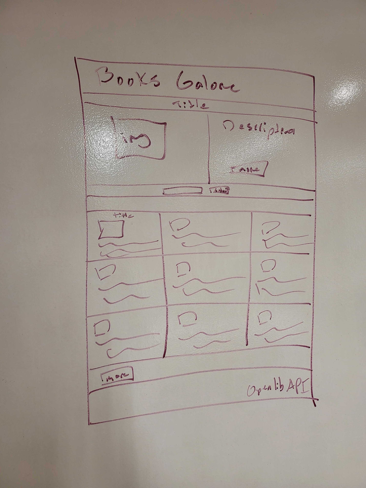

Title: Books Galore

This site is a service where you are able to search for a book or author.

Said book is then shown in terms of its cover art and description with the description being able to be collapsed and expanded.

We then search for books by that author and display the top 9 down below filtering by language and titles to ensure no repeats.

We then give those 9 books the same service as the original book, but on a smaller scale.

There is also a button to see the next 9 books and then the next 9 until it eventually wraps back to the begginging.

In order to accomplish all of this I used the Open Library API without which none of this would've been possible.

This is Books Galore and it's been a pleasure.

Below is my original Wire Frame:

